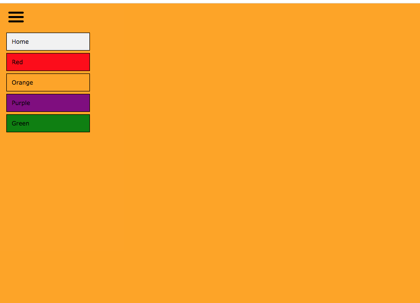

# **Project KleurenToggle**
Winc Academy Project - Week 1: KleurenToggle

Screenshot

Bekijk de live versie van de KleurenToggle: https://michellescolortoggle.netlify.app/

Met dit project heb ik mijn eerste toggle menu gemaakt met JavaScript. 
Het gaat om een keuzemenu waarmee je de achtergrondkleur van je webpagina kunt veranderen.

# **Requirements**

Aan deze minimale eisen moet jouw project voldoen:

1. Als gebruiker wil ik op een hamburger-icoon kunnen klikken dat uitklapt als ik er op klik. 
2. Als gebruiker wil ik in het uitgeklapte menu een keuze hebben aan kleuren (uitgeschreven in tekst). Elk item in het menu is één kleur.
3. Als gebruiker wil ik op één van de kleuren kunnen klikken. 
4. Wanneer ik als gebruiker op de kleur in het menu heb geklikt verandert de achtergrondkleur van de gehele pagina in de aangeklikte kleur.
5. Wanneer ik als gebruiker op de kleur in het menu klik, klapt het menu weer terug in.

# **Bonus Requirements**

- Als gebruiker wil ik niet alleen de kleurennamen lezen, ik wil ook de kleuren kunnen zien in het menu. Elke "rij" in het menu heeft toont een kleur.
- Als gebruiker wil ik op een radiobutton kunnen klikken van de kleur van mijn keuze, waardoor ik aan de radiobutton zie wat de huidige kleur is die "actief" is op dit moment.
- Als gebruiker wil ik in plaats van klikken met mijn muis over de hamburger kunnen hoveren, waardoor het menu verschijnt. Wanneer ik als gebruiker met mijn muis weer wegga bij het menu verdwijnt het menu weer.

